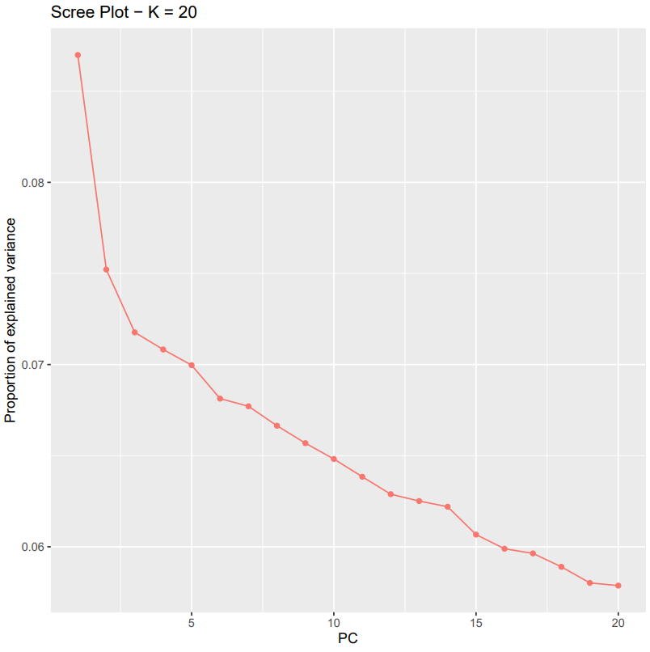
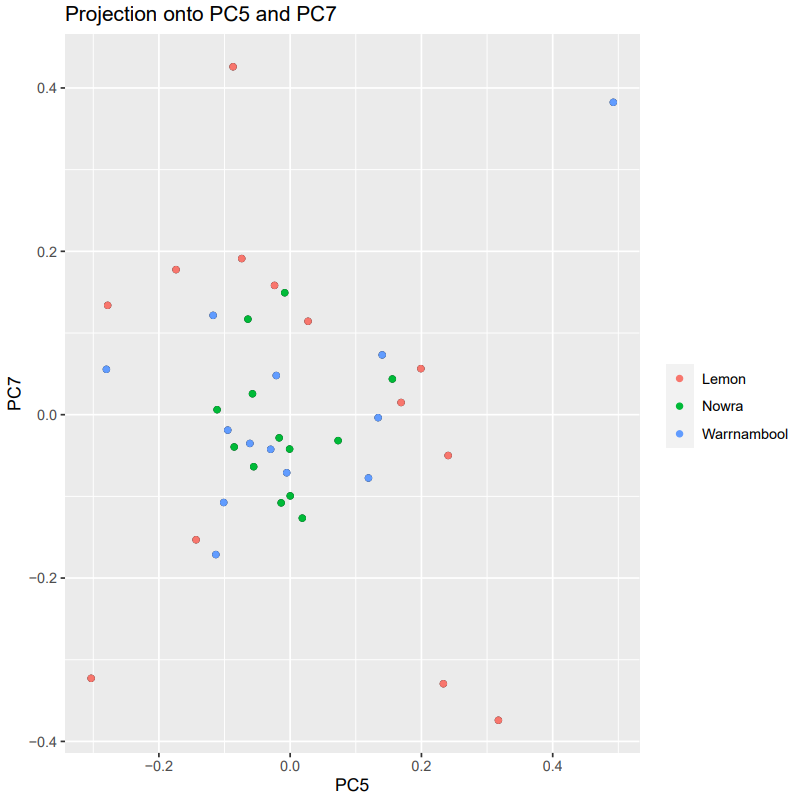
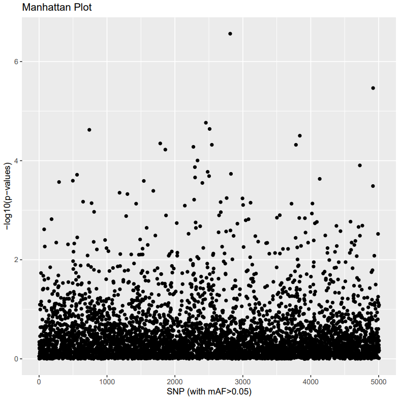
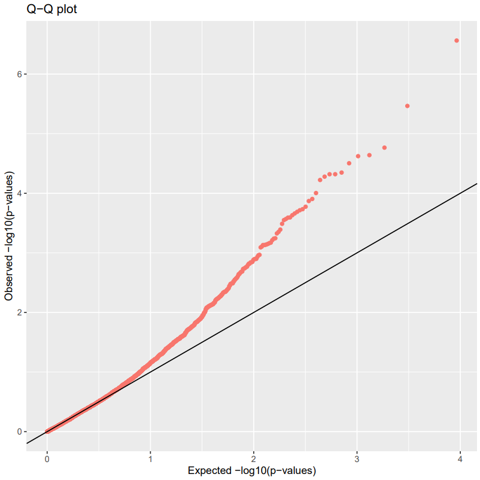

# PCAdapt

PCAdapt uses an ordination approach to find sites in a data set that are outliers with respect to background population structure. The PCAdapt manual is available [here](https://bcm-uga.github.io/pcadapt/articles/pcadapt.html). 

!!! abstract "Citation"

    Privé, F., Luu, K., Vilhjálmsson, B. J., & Blum, M. G. B. (2020). Performing Highly Efficient Genome Scans for Local Adaptation with R Package pcadapt Version 4. Mol Biol Evol, 37(7), 2153-2154. https://doi.org/10.1093/molbev/msaa053 


First, let's install PCAdapt and set your working directory.

!!! terminal "code"

    ```bash
    module load R/4.1.0-gimkl-2020a
    R
    ```

!!! r-project "code"

    ```r
    library("pcadapt")

    setwd("/nesi/nobackup/uoa02613/kstuart_projects/outlier_analysis/analysis/pcadapt/")
    ```

Now let's load in the data - PCAdapt uses bed file types.

!!! r-project "code"

    ```r
    starlings_bed <- "/nesi/nobackup/uoa02613/kstuart_projects/outlier_analysis/data/starling_3populations.bed"
    starlings_pcadapt <- read.pcadapt(starlings_bed, type = "bed")
    ```

Produce K plot

!!! r-project "code"

    ```r
    starlings_pcadapt_kplot <- pcadapt(input = starlings_pcadapt, K = 20)
    pdf("pcadapt_starlings_kplot.pdf")
    plot(starlings_pcadapt_kplot, option = "screeplot")
    dev.off()
    ```

{alt="k-plot", width="600px"}

K value of 3 is most appropriate, as this is the value of K after which the curve starts to flatten out more.

!!! r-project "code"

    ```r
    starlings_pcadapt_pca <- pcadapt(starlings_pcadapt, K = 3)
    summary(starlings_pcadapt_pca)
    ```

    ??? success "Output"

        ```
                        Length  Class  Mode
        scores            117  -none-  numeric
        singular.values     3  -none-  numeric
        loadings        15021  -none-  numeric
        zscores         15021  -none-  numeric
        af               5007  -none-  numeric
        maf              5007  -none-  numeric
        chi2.stat        5007  -none-  numeric
        stat             5007  -none-  numeric
        gif                 1  -none-  numeric
        pvalues          5007  -none-  numeric
        pass             4610  -none-  numeric
        ```

Investigate axis projections:

!!! r-project "code"

    ```r
    poplist.names <- c(rep("Lemon", 13),rep("Warrnambool", 13),rep("Nowra", 13))
    print(poplist.names)

    pdf("pcadapt_starlings_projection1v2.pdf")
    plot(starlings_pcadapt_kplot, option = "scores", i = 1, j = 2, pop = poplist.names)
    dev.off()

    pdf("pcadapt_starlings_projection5v7.pdf")
    plot(starlings_pcadapt_kplot, option = "scores", i = 5, j = 7, pop = poplist.names)
    dev.off()
    ```

!!! warning "Ignore the warning:"

    ```
    Warning message:
    Use of `df$Pop` is discouraged. Use `Pop` instead.
    ```

{width="600px"}

{width="600px"}

Investigate Manhattan and Q-Qplot:

!!! note "Manhattan plots"

    A way to visualise the GWAS (genome-wide association study) p-values (or other statistical values) at each SNP locus along the genome.

!!! note "Q-Qplots"

    A quick way to visually check if your residuals are normally distributed. Check out more information [here](https://data.library.virginia.edu/understanding-q-q-plots/).

!!! r-project "code"

    ```r
    pdf("pcadapt_starlings_manhattan.pdf")
    plot(starlings_pcadapt_pca, option = "manhattan")
    dev.off()

    pdf("pcadapt_starlings_qqplot.pdf")
    plot(starlings_pcadapt_pca, option = "qqplot")
    dev.off()
    ```

 


Plotting and correcting the p-values

!!! r-project "code"

    ```r
    pdf("pcadapt_starlings_pvalues.pdf")
    hist(starlings_pcadapt_pca$pvalues, xlab = "p-values", main = NULL, breaks = 50, col = "orange")
    dev.off()
    ```

{width="600px"}

!!! r-project "code"

    ```r
    starlings_pcadapt_padj <- p.adjust(starlings_pcadapt_pca$pvalues,method="bonferroni")
    alpha <- 0.1
    outliers <- which(starlings_pcadapt_padj < alpha)
    length(outliers)

    write.table(outliers, file="starlings_pcadapt_outliers.txt")
    ```

    ??? success "Output"

        ```
        [1] 3
        ```

After this, we will be jumping out of R and back into the command line by using the command: 

!!! r-project "code"

    ```r
    q()
    ```

### Mapping Outliers: PCAdapt

Finding the SNP ID of the outlier variants

!!! terminal "code"

    ```bash
    cd $DIR/analysis
    ```

The first thing we will do is create a list of SNPs in VCF, assign line numbers that can be used to find matching line numbers in outliers (SNP ID is lost in PCadapt & Bayescan, line numbers used as signifiers). 

We create this in the `analysis` folder because we will use it for more than just mapping the outlier SNPs for PCAdapt.

!!! terminal "code"

    ```bash
    grep -v "^#" $DIR/data/starling_3populations.recode.vcf | cut -f1-3 | awk '{print $0"\t"NR}' > starling_3populations_SNPs.txt
    ```

Now let's jump back into the `pcadapt` directory to continue working with our outliers. We select column 2 of the outlier file using the `AWK` command, which contain the number of the outliers.

!!! terminal "code"

    ```bash
    cd $DIR/analysis/pcadapt
    awk '{print $2}' starlings_pcadapt_outliers.txt > starlings_pcadapt_outliers_numbers.txt
    ```

We now make a list of outlier SNPS ID's

!!! terminal "code"

    ```bash
    awk 'FNR==NR{a[$1];next} (($4) in a)' starlings_pcadapt_outliers_numbers.txt ../starling_3populations_SNPs.txt | cut -f3 > pcadapt_outlierSNPIDs.txt
    head pcadapt_outlierSNPIDs.txt
    ```

    ??? success "Output"

        ```
        230955:72:-
        238881:46:+
        286527:46:-
        ```
