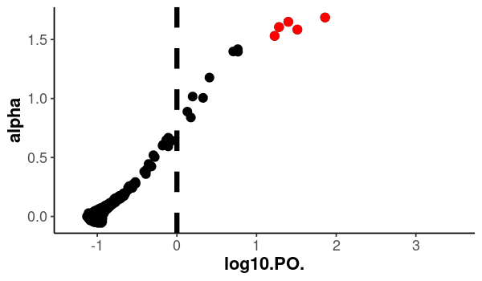

# BayeScan

The BayeScan manual is available [here](https://github.com/mfoll/BayeScan).

!!! abstract "Citation"

    Foll, M., & Gaggiotti, O. (2008). A genome-scan method to identify selected loci appropriate for both dominant and codominant markers: A Bayesian perspective. Genetics, 180(2), 977-993. https://doi.org/10.1534/genetics.108.092221 


BayeScan identifies outlier SNPs based on allele frequencies.

!!! tip "Prepare your terminal session"

    Since you are likely using a new terminal session today, you will need to set the environment variables again to use them. Copy and paste the following command into your terminal to ensure you reference the correct variables.

    ```bash
    DIR=~/outlier_analysis
    VCF=$DIR/data/starling_3populations.recode.vcf
    METADATA=$DIR/data/starling_3populations_metadata.txt
    ```

First, we will need to convert our VCF to the Bayescan format. To do this, we will use the genetic file conversion program [PGDspider](http://www.cmpg.unibe.ch/software/PGDSpider/). 

!!! terminal "code"

    ```bash
    cd $DIR/programs
    wget http://www.cmpg.unibe.ch/software/PGDSpider/PGDSpider_2.1.1.5.zip
    unzip *.zip
    ```
    
We also need to create a new populations metadata file containing individual names in column 1 and population names in column 2.

!!! terminal "code"

    ```bash
    cd $DIR/data
    cut -f1,2 $METADATA > starling_3populations_metadata_INDPOP.txt
    ```

Now, navigate to the directory where we will run our Bayescan analysis.

!!! terminal "code"

    ```bash
    cd $DIR/analysis/bayescan
    ```

We will run PGDSpider in two steps: 

1. Convert the VCF file to the PGD format 
1. Convert PGD format to Bayescan format. 

To do this, we will need to create a SPID file, which we will call `VCF_PGD.spid`, using the `nano` command.


!!! terminal "code"

    ```bash
    nano VCF_PGD.spid
    ```

Into the `VCG_PGD.spid` file, copy and paste the code below. On the line that starts with `VCF_PARSER_POP_FILE_QUESTION`, replace the example location with the location of your metadata file.

!!! note "Write the following into `VCF_PGD.spid`"

    ```
    # VCF Parser questions
    PARSER_FORMAT=VCF
    # Only output SNPs with a phred-scaled quality of at least:
    VCF_PARSER_QUAL_QUESTION=
    # Select population definition file:
    VCF_PARSER_POP_FILE_QUESTION=/home/<user>/outlier_analysis/data/starling_3populations_metadata_INDPOP.txt
    # What is the ploidy of the data?
    VCF_PARSER_PLOIDY_QUESTION=DIPLOID
    # Do you want to include a file with population definitions?
    VCF_PARSER_POP_QUESTION=true
    # Output genotypes as missing if the Phred-scale genotype quality is below:
    VCF_PARSER_GTQUAL_QUESTION=
    # Do you want to include non-polymorphic SNPs?
    VCF_PARSER_MONOMORPHIC_QUESTION=false
    # Only output following individuals (ind1, ind2, ind4, ...):
    VCF_PARSER_IND_QUESTION=
    # Only input following regions (refSeqName:start:end, multiple regions: whitespace separated):
    VCF_PARSER_REGION_QUESTION=
    # Output genotypes as missing if the read depth of a position for the sample is below:
    VCF_PARSER_READ_QUESTION=
    # Take most likely genotype if "PL" or "GL" is given in the genotype field?
    VCF_PARSER_PL_QUESTION=false
    # Do you want to exclude loci with only missing data?
    VCF_PARSER_EXC_MISSING_LOCI_QUESTION=false

    # PGD Writer questions
    WRITER_FORMAT=PGD
    ```

!!! note "Replace path for `VCF_PARSER_POP_FILE_QUESTION`"

    Please remember to replace `<user>` with your user ID in the above or the absolute path to where your `_metadata_INDPOP.txt` is located!

??? tip "Writing out files with `nano`"

    Once you have copied and pasted the above, press <kbd>Ctrl</kbd> + <kbd>O</kbd>, then press <kbd>Enter</kbd> to save your file. Finally, exit the program using <kbd>Ctrl</kbd> + <kbd>X</kbd>

Run the two-step conversion.

!!! terminal "code" 

    ```bash
    module purge
    module load Java/1.8.0_144

    java -Xmx1024m -Xms512m -jar $DIR/programs/PGDSpider_2.1.1.5/PGDSpider2-cli.jar -inputfile $VCF -inputformat VCF -outputfile starling_3populations.pgd -outputformat PGD -spid VCF_PGD.spid

    java -Xmx1024m -Xms512m -jar $DIR/programs/PGDSpider_2.1.1.5/PGDSpider2-cli.jar -inputfile starling_3populations.pgd -inputformat PGD -outputfile starling_3populations.bs -outputformat GESTE_BAYE_SCAN
    ```

    ??? success "Output"

        ```
        INFO  12:54:18 - load PGDSpider configuration from: /scale_wlg_nobackup/filesets/nobackup/nesi02659/outlier_analysis_workshop/programs/PGDSpider_2.1.1.5/spider.conf.xml
        Warning: Could not get charToByteConverterClass!
        initialize convert process...
        read input file...
        read input file done.
        write output file...
        write output file done.
        ```

    ??? success "Output"

        ```
        INFO  12:57:05 - load PGDSpider configuration from: /scale_wlg_nobackup/filesets/nobackup/nesi02659/outlier_analysis_workshop/programs/PGDSpider_2.1.1.5/spider.conf.xml
        Warning: Could not get charToByteConverterClass!
        No SPID file specified containing preanswered conversion questions!!!
          A template SPID file was saved under: template_PGD_GESTE_BAYE_SCAN.spid
          for more details see manual.

        initialize convert process...
        read input file...
        read input file done.
        write output file...
        write output file done.
        ```

Let us have a quick look at what the input file looks like.

!!! terminal "code"

    ```bash
    head starling_3populations.bs
    ```

    ??? success "Output"

        ```
        [loci]=5007

        [populations]=3

        [pop]=1
         1      12      2       9 3 
         2      20      2       11 9 
         3      18      2       15 3 
         4      20      2       0 20 
         5      22      2       2 20
        ```

So for each population, we have a note of how many REF and ALT alleles we have at each genomic variant position.

!!! note "An important note about additive genetic variance"

    It is important to bear in mind how the input genetic data for outlier or association models is being interpreted by the model. When dealing with many of these models (and input genotype files), the assumption is that SNP effects are [additive](https://link.springer.com/referenceworkentry/10.1007/978-3-319-47829-6_5-1). This can be seen from, for example, the way we encode homozygous reference allele, heterozygous, and homozygous alternate allele as "0", "1", and "2" respectively in a BayPass input genofile. For the diploid organism (with two variant copies for each allele), one copy of a variant (i.e., heterozygous) is assumed to have half the effect of having two copies. However, what if the locus in question has dominance effects? This would mean the heterozygous form behaves the same as the homozygous dominant form, and it would be more appropriate to label these instead as "0", "0", "1". But with thousands, if not millions, of (most likely) completely unknown variants in a dataset, how can we possibly know? The answer is we cannot. Most models assume additive effects since this is the simplest assumption. However, by not factoring in dominance effects, we could be missing many important functional variants, as [Reynolds et al. (2021)](https://www.nature.com/articles/s41588-021-00872-5) demonstrates. Genomics is full of caveats and pitfalls. While it provides new directions for exploration, it can also be overwhelming. Remember, your selection analysis does not have to be exhaustive. Just make sure it is fit for purpose within your study design. There is so much going on in just one genome; there is no way you can analyze everything in one go.

Now let us set Bayescan to run. Use the command `nano bayescan_starling.sl` to create a Slurm script.

!!! terminal "code"

    ```bash
    #!/bin/bash -e
    #SBATCH --account=nesi02659
    #SBATCH --job-name=bayescan_starling.sl
    #SBATCH --time=12:00:00
    #SBATCH --mem=5GB
    #SBATCH --output=%x_%j.out
    #SBATCH --error=%x_%j.err
    #SBATCH --ntasks=1
    #SBATCH --cpus-per-task=8
    #SBATCH --profile task

    cd ~/outlier_analysis/analysis/bayescan

    # Load bayescan
    module purge
    module load BayeScan/2.1-GCCcore-7.4.0

    # Run bayescan. 
    bayescan_2.1 ./starling_3populations.bs -od ./ -threads 8 -n 5000 -thin 10 -nbp 20 -pilot 5000 -burn 50000 -pr_odds 10
    ```

Once you have copied and pasted the above, submit your job script to the scheduler to run using the command `sbatch bayescan_starling.sl`. It should take approximately 1 hour to run. Currently, everything is set to default. Read the manual to understand what the arguments/flags mean and how to refine them if needed.

Identify outliers:

!!! terminal "code"

    ```bash
    module load R-bundle-Bioconductor/3.15-gimkl-2022a-R-4.2.1
    R
    ```

!!! r-project "code"

    ```r
    library(ggplot2)
    setwd("~/outlier_analysis/analysis/bayescan")

    source("/opt/nesi/CS400_centos7_bdw/BayeScan/2.1-GCCcore-7.4.0/R\ functions/plot_R.r")

    outliers.bayescan <- plot_bayescan("starling_3population_fst.txt", FDR = 0.05)
    outliers.bayescan

    write.table(outliers.bayescan, file = "bayescan_outliers.txt")

    q()
    ```

    ??? success "Output"
    
        ```
        $outliers
        [1]  333  395 1367 2376 3789

        $nb_outliers
        [1] 5
        ```

Mapping Outliers

!!! terminal "code"

    ```bash
    cd $DIR/analysis/bayescan
    ```

Create a list of SNPs in VCF, assign line numbers that can be used to find matching line numbers in outliers (SNP IDs are lost in bayescan, line numbers are used as signifiers).

!!! terminal "code"

    ```bash
    grep -v "^#" $DIR/data/starling_3populations.recode.vcf  | cut -f1-3 | awk '{print $0"\t"NR}' > starling_3populations_SNPs.txt

    awk '{print $2}' bayescan_outliers.txt > bayescan_outliers_numbers.txt
    ```

Create a list of outlier SNPs by matching the values in column 1 of the outliers list with those in column 4 of the entire SNP data list.

!!! terminal "code"

    ```bash
    awk 'FNR==NR{a[$1];next} (($4) in a)' bayescan_outliers_numbers.txt starling_3populations_SNPs.txt | cut -f3 > bayescan_outlierSNPIDs.txt
    ```

Create a Bayescan log-plot and color the outliers in a different color.

!!! terminal "code"

    ```bash
    module load R-bundle-Bioconductor/3.15-gimkl-2022a-R-4.2.1
    R
    ```

!!! r-project "code"

    ```r
    library(ggplot2)
    library(dplyr)
    setwd("~/outlier_analysis/analysis/bayescan")

    bayescan.out <- read.table("starling_3population_fst.txt", header=TRUE)
    bayescan.out <- bayescan.out %>% mutate(ID = row_number())
    bayescan.outliers <- read.table("bayescan_outliers_numbers.txt", header=FALSE)
    outliers.plot <- filter(bayescan.out, ID %in% bayescan.outliers[["V1"]])

    png("bayescan_outliers.png", width=600, height=350)

    ggplot(bayescan.out, aes(x = log10.PO., y = alpha)) +
      geom_vline(
        xintercept = 0,
        linetype = "dashed",
        color = "black",
        size = 3
      ) +
      geom_point(
        size = 5
      ) +
      geom_point(
        aes(x = log10.PO., y = alpha),
        data = outliers.plot,
        col = "red",
        fill = "red",
        size = 5
      ) +
      scale_x_continuous(limits = c(-1.3, 3.5)) +
      theme_classic(base_size = 18) +
      theme(axis.text = element_text(size = 18),
            axis.title = element_text(size = 22, face = "bold"))

    dev.off()

    q()
    ```
<!-- Switch the png to pdf -->
<!-- Clean up ggplot2 code, lots of redundancy -->

{width="600px"}

