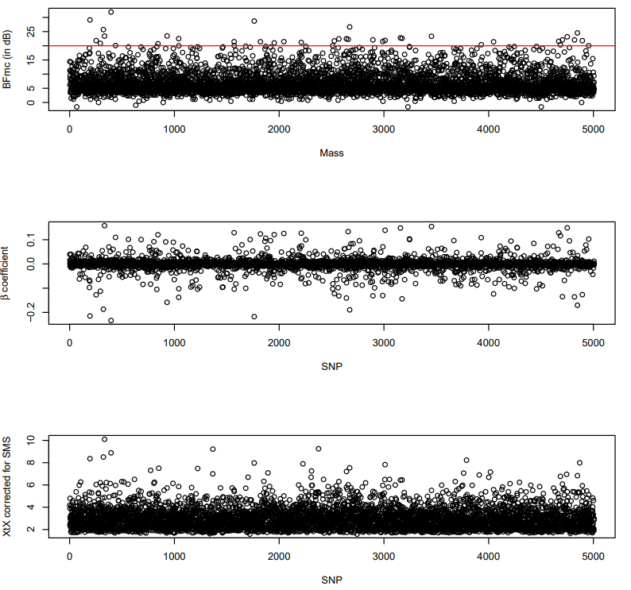

# BayPass

The Baypass manual can be found [here](http://www1.montpellier.inra.fr/CBGP/software/baypass/files/BayPass_manual_2.31.pdf).

!!! abstract "Citation"

    Gautier M 2015 Genome-Wide Scan for Adaptive Divergence and Association with Population-Specific Covariates. Genetics 201 1555–1579. (doi:10.1534/genetics.115.181453)

Baypass requires that the allele frequency data be on a population, not an individual basis. The genotyping data file is simply organized as a matrix with nsnp rows and 2 ∗ npop columns. The row field separator is a space. More precisely, each row corresponds to one marker and the number of columns is twice the number of populations because each pair of numbers corresponds to each allele (or read counts for PoolSeq experiment) counts in one population. 

To generate this population gene count data we will work with the PLINK file. First we have to fix the individual ID and population labels, as PLINK has pulled these directly from the VCF which has no population information. What we are aiming for is population in column 1, and individual ID in column 2.

!!! terminal "code"

    ```bash
    cd $DIR/data

    awk '{print $2,"\t",$1}' $METADATA > starling_3populations_metadata_POPIND.txt

    cd $DIR/analysis/baypass

    PLINK=$DIR/data/starling_3populations.plink.ped

    #remove first 2 columns
    cut -f 3- $PLINK > x.delete

    paste $DIR/data/starling_3populations_metadata_POPIND.txt x.delete > starling_3populations. plink.ped
    rm x.delete 

    cp $DIR/data/starling_3populations.plink.map .
    cp $DIR/data/starling_3populations.plink.log .
    ```

run the pop based allele frequency calculations

!!! terminal "code"

    ```bash
    module load PLINK/1.09b6.16 

    plink --file starling_3populations.plink --allow-extra-chr --freq counts --family --out starling_3populations
    ```

manipulate file so it has baypass format, numbers set for plink output file and pop number for column count

!!! terminal "code"

    ```bash
    tail -n +2 starling_3populations.frq.strat | awk '{ $9 = $8 - $7 } 1' | awk '{print $7,$9}' | tr "\n" " " | sed 's/ /\n/6; P; D' > starling_3populations_baypass.txt
    ```

Now we can run Baypass by creating a slurm script `baypass1_starling.sl`, which should run for about 5 minutes.

!!! terminal "code"

    ```bash
    #!/bin/bash -e
    #SBATCH --job-name=2023_04_14.baypass1_starling.sl
    #SBATCH --account=uoa02613
    #SBATCH --time=00-12:00:00
    #SBATCH --mem=5GB
    #SBATCH --output=%x_%j.errout
    #SBATCH --mail-user=katarina.stuart@auckland.ac.nz
    #SBATCH --mail-type=ALL
    #SBATCH --nodes=1
    #SBATCH --ntasks=1
    #SBATCH --cpus-per-task=4
    #SBATCH --profile task

    module load BayPass/2.31-intel-2022a

    cd /nesi/nobackup/uoa02613/kstuart_projects/outlier_analysis/analysis/baypass

    i_baypass -npop 3 -gfile ./starling_3populations_baypass.txt -outprefix starling_3populations_baypass -nthreads 4
    ```

Running in R to make the anapod data. First let's quickly download the utils we need.

!!! terminal "code"

    ```bash
    cd $DIR/programs
    git clone https://github.com/andbeck/BayPass.git
    ```

Now let's generate some simulated data, based on the parameters calculated from our genetic data.

!!! terminal "code"

    ```bash
    module load R/4.1.0-gimkl-2020a
    R
    ```

!!! r-project "code"

    ```r
    setwd("/nesi/nobackup/uoa02613/kstuart_projects/outlier_analysis/analysis/baypass")
    source("/nesi/nobackup/uoa02613/kstuart_projects/outlier_analysis/programs/BayPass/baypass_utils.R")

    install.packages("ape")
    library("ape")

    install.packages("corrplot")
    library("corrplot")

    omega=as.matrix(read.table("starling_3populations_baypass_mat_omega.out"))
    pi.beta.coef=read.table("starling_3populations_baypass_summary_beta_params.out",h=T)$Mean
    bta14.data<-geno2YN("starling_3populations_baypass.txt")
    simu.bta<-simulate.baypass(omega.mat=omega, nsnp=5000, sample.size=bta14.data$NN, beta.pi=pi.beta.coef,pi.maf=0,suffix="btapods")

    q()
    ```

We now have the simulated genetic data, we can find the XtX statistic threshold above which we will consider genetic sites an outlier. Let's create another script in `cd $DIR/analysis/baypass` called `baypass2_starling.sl`.

!!! terminal "code"

    ```bash
    #!/bin/bash -e
    #SBATCH --job-name=2023_04_14.baypass2_starling.sl
    #SBATCH --account=uoa02613
    #SBATCH --time=00-12:00:00
    #SBATCH --mem=5GB
    #SBATCH --output=%x_%j.errout
    #SBATCH --mail-user=katarina.stuart@auckland.ac.nz
    #SBATCH --mail-type=ALL
    #SBATCH --nodes=1
    #SBATCH --ntasks=1
    #SBATCH --cpus-per-task=4
    #SBATCH --profile task

    module load BayPass/2.31-intel-2022a

    cd /nesi/nobackup/uoa02613/kstuart_projects/outlier_analysis/analysis/baypass

    i_baypass -npop 3 -gfile G.btapods  -outprefix G.btapods -nthreads 4 
    ```

XtX calibration; get the pod XtX theshold

!!! terminal "code"

    ```bash
    module load R/4.1.0-gimkl-2020a
    R
    ```

!!! r-project "code"

    ```r
    setwd("/nesi/nobackup/uoa02613/kstuart_projects/outlier_analysis/analysis/baypass")
    source("/nesi/nobackup/uoa02613/kstuart_projects/outlier_analysis/programs/BayPass/baypass_utils.R")
    library("ape")
    library("corrplot")

    pod.xtx=read.table("G.btapods_summary_pi_xtx.out",h=T)$M_XtX
    ```

We compute the 1% threshold for the simulated neutral data.

!!! r-project "code"

    ```r
    pod.thresh=quantile(pod.xtx,probs=0.99)
    pod.thresh

    q()
    ```

    ??? success "Output"

        ```
        6.258372
        ```

Your values may be slightly different as the simulated data will not be identical.

Next, we filter the data for the outlier snps by identifying those above the threshold.

!!! terminal "code"

    ```bash
    cat starling_3populations_baypass_summary_pi_xtx.out | awk '$4>6.258372 ' > baypass_outliers.txt
    ```

create list of SNPs in VCF, assign line numbers that can be used to find matching line numbers in outliers (SNP ID is lost in bayescan, line numbers used as signifiers).

!!! terminal "code"

    ```bash
    grep -v "^#" $VCF  | cut -f1-3 | awk '{print $0"\t"NR}' > starling_3populations_SNPs.txt
    ```

List of outlier SNPS

!!! terminal "code"

    ```bash
    awk 'FNR==NR{a[$1];next} (($4) in a)' baypass_outliers.txt starling_3populations_SNPs.txt | cut -f3 > baypass_outlierSNPIDs.txt
    wc -l baypass_outlierSNPIDs.txt
    ```

    ??? success "Output"

        ```
        38
        ```

Low lets find SNPs that are statistically associated with wingspan. To do this we have to go back to the metadata and compute the average wingspan of each of out populations and place them in a file.

!!! terminal "code"

    ```bash
    module load R/4.1.0-gimkl-2020a
    R
    ```

!!! r-project "code"

    ```r
    setwd("/nesi/nobackup/uoa02613/kstuart_projects/outlier_analysis/analysis/baypass")
    metadata <- read.table("/nesi/nobackup/uoa02613/kstuart_projects/outlier_analysis/data/starling_3populations_metadata.txt", sep="\t", header=FALSE)
    str(metadata)
    pop_metadata <- aggregate(V3 ~ V2, data = metadata, mean)
    write(pop_metadata[,2], "pop_mean_wingspan.txt")

    q()
    ```

    ??? success "Output:"

        ```
        14.89805 19.63306 22.09655
        ```

Now we can submit a third and final baypass job `baypass3_starling.sl`, which will let us know which SNPs are statistically associated with wingspan.

!!! terminal "code"

    ```bash
    #!/bin/bash -e
    #SBATCH --job-name=2023_04_14.baypass3_starling.sl
    #SBATCH --account=uoa02613
    #SBATCH --time=00-12:00:00
    #SBATCH --mem=5GB
    #SBATCH --output=%x_%j.errout
    #SBATCH --mail-user=katarina.stuart@auckland.ac.nz
    #SBATCH --mail-type=ALL
    #SBATCH --nodes=1
    #SBATCH --ntasks=1
    #SBATCH --cpus-per-task=4
    #SBATCH --profile task

    module load BayPass/2.31-intel-2022a

    cd /nesi/nobackup/uoa02613/kstuart_projects/outlier_analysis/analysis/baypass

    i_baypass -npop 3 -gfile starling_3populations_baypass.txt -efile pop_mean_wingspan.txt -scalecov -auxmodel -nthreads 4 -omegafile starling_3populations_baypass_mat_omega.out -outprefix starling_3populations_baypass_wing
    ```

Next we plot the outliers. We are chosing a [BF threshold](https://www.statology.org/bayes-factor/) of 20 dB, which indicates "Strong evidence for alternative hypothesis".

!!! terminal "code"

    ```bash
    module load R/4.1.0-gimkl-2020a
    R
    ```

!!! r-project "code"

    ```r
    library(ggplot2)

    setwd("/nesi/nobackup/uoa02613/kstuart_projects/outlier_analysis/analysis/baypass")

    covaux.snp.res.mass=read.table("starling_3populations_baypass_wing_summary_betai.out",h=T)
    covaux.snp.xtx.mass=read.table("starling_3populations_baypass_summary_pi_xtx.out",h=T)$M_XtX

    pdf("Baypass_plots.pdf")
    layout(matrix(1:3,3,1))
    plot(covaux.snp.res.mass$BF.dB.,xlab="Mass",ylab="BFmc (in dB)")
    abline(h=20, col="red")
    plot(covaux.snp.res.mass$M_Beta,xlab="SNP",ylab=expression(beta~"coefficient"))
    plot(covaux.snp.xtx.mass, xlab="SNP",ylab="XtX corrected for SMS")
    dev.off()
    ```

{width="500px"}

Finally, lets generate the list of phenotype-associated SNP IDs. 

!!! terminal "code"

    ```bash
    cat starling_3populations_baypass_wing_summary_betai.out | awk '$6>20' > starling_3populations_baypass_wing_BF20.txt
    starling_3populations_baypass_wing_BF20.txt

    wc -l starling_3populations_baypass_wing_BF20.txt
    ```

    ??? success "Output"

        ```
        48
        ```

Filtering the data sets for SNPS above BFmc threshold - these are out outlier SNPs that are associated with wingspan. 

!!! terminal "code"

    ```bash
    awk 'FNR==NR{a[$2];next} (($4) in a)' starling_3populations_baypass_wing_BF20.txt starling_3populations_SNPs.txt | cut -f3 > baypass_wingspan_outlierSNPIDs.txt

    comm -12 <(sort baypass_wingspan_outlierSNPIDs.txt) <(sort baypass_outlierSNPIDs.txt) > double_outliers.txt

    wc -l double_outliers.txt
    ```

    ??? success "Output"

        ```
        18
        ```
