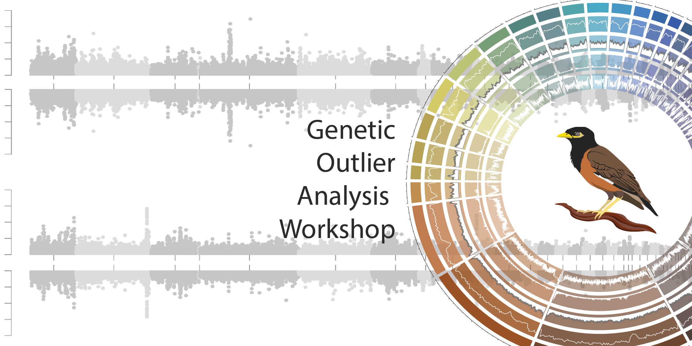

<h1><b>Outlier Analysis Workshop</b></h1>

## Preamble

There are lots of interesting patterns that you can extract from genetic variant data. This can include patterns of linkage, balancing selection, or even inbreeding signals. One of the most common ones is to try find sites on the genome that are under selection. The following vignette will take you through the basics of genetic selection analysis. 

| 
 **Day**
           | **Lesson overview**                                                                       |
| :------------------------------------------------ | :---------------------------------------------------------------------------------------- |
| [  Day 1  ](""){ .md-button .md-button--primary } | Introduction PCAdapt VCFtools Setup for Bayescan & Baypass                       |
| [  Day 2  ](""){ .md-button .md-button--primary } | Bayescan Bayepass Compile results Group discussions Meta-analysis contribution |
|                                                   |                                                                                           |

??? calendar-days "Schedule"

    === "Day 1"
    
        | **Time** | **Event**                                          |
        | :------- | :------------------------------------------------- |
        | 9:00am   | Introductory slides                                |
        | 9:30am   | Download data                                      |
        | 10:00am  | Morning tea                                        |
        | 10:15am  | PCAdapt                                            |
        | 12:00pm  | Lunch                                              |
        | 1:00pm   | VCFtools                                           |
        | 2:00pm   | Afternoon tea                                      |
        | 2:15pm   | VCFtools continued Setup for Bayescan & Baypass |

    === "Day 2"

        | **Time** | **Event**                                                          |
        | :------- | :----------------------------------------------------------------- |
        | 9:00am   | Bayescan                                                           |
        | 10:00am  | Morning tea                                                        |
        | 10:15am  | Bayescan (continued) Baypass                                    |
        | 12:00pm  | Lunch                                                              |
        | 1:00pm   | Baypass (continued)                                                |
        | 2:00pm   | Afternoon tea                                                      |
        | 2:15pm   | Compile results Group discussions Meta-analysis contribution |

!!! note "Funding"

    The project has been funded by <a href="https://ausevo.com/ECR_grants_2022/">the AES ERC Networking Grant Scheme</a> and <a href="https://genetics.org.au/">GSA</a>.

